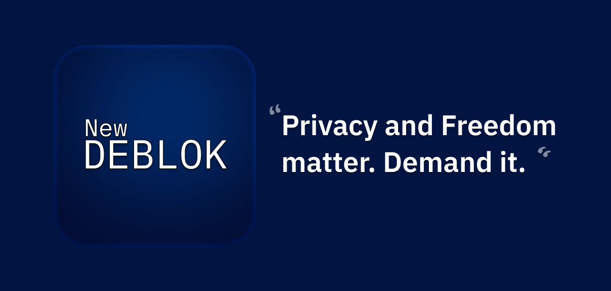

### The state of New Deblok:

- Total: ~90% complete
- DeblokManager: 100% complete, nothing needs work in this area
- Backend: 100% complete, This probably says 100% but rare's still cookin the backend.
- Frontend: 85% done, need finishing touches & settings needs work
- Backend Proxies: 100% done, nothing needs work in this area

---

# 

The New Deblok is a project ditching what Deblok used to run off of, Kasm Workspaces; and using a DIY solution with the help of [DeblokManager](https://github.com/Deblok-Workshop/DeblokManager) to dynamically spawn and kill Docker containers easily, also using [noVNC](https://github.com/noVNC/noVNC) for remote control.

## What is Deblok?

Deblok is a selfhostable website that allows you to browse and stream apps, games, and operating systems safely, remotely, and securely. Completely for free, with minimal paywalls.

## For chromebook skids

- I **strongly **do not** recommend** you to deploy NewDeblok to a service like Vercel.
- Use `bun run build` instead of `bun run watch` if you don't need to watch the files.
- You \***\*have\*\*** to selfhost DeblokManager. It cannot be deployed to a service like Vercel.

# Donate to me!

(If you donate $0.25 or more, you can get the `@Donator` role in the [Discord](https://discord.gg/surfskip))

- Crypto:
  - **BTC**: `186dGbqMAFLPzQAbdzaYtAWDiQwgDPFq8y`
  - **Any ETH Token/Coin**: `0x4913AAb84c4b5f91753Ea517d372F0662e70CEEf`
  - **SOL**: `DUZ4RFKtptxynzk9NEqvisNNyRBK5f6DzjADSQ1d51rk`
  - **DOGE**: `DTpTrzDSDjswGhFcGm3Eaq832grWDpAAZD`
  - **LTC**: `LTaj6GCGJXQMtVcX1XtTeDWN4Yt2oaZTQ6` (Preferred)
  - **XMR**: `49LFZRV4mdFgL5S8Tgr94g96L5dwE7Lx9b9ouetbFxwNKLpuL8y7CbBHMJjVv9KefLVh8uejfiNZiZFEVATqREDKAufEnqL`

---

## Legal Notice

Deblok is licensed under GNU General Public License v3.0 (GPLv3). By using, forking, or modifying the code, you agree to comply with the terms of this license.

## Made with love from everyone at Deblok-Workshop ❤️ (realistically mostly rare)
